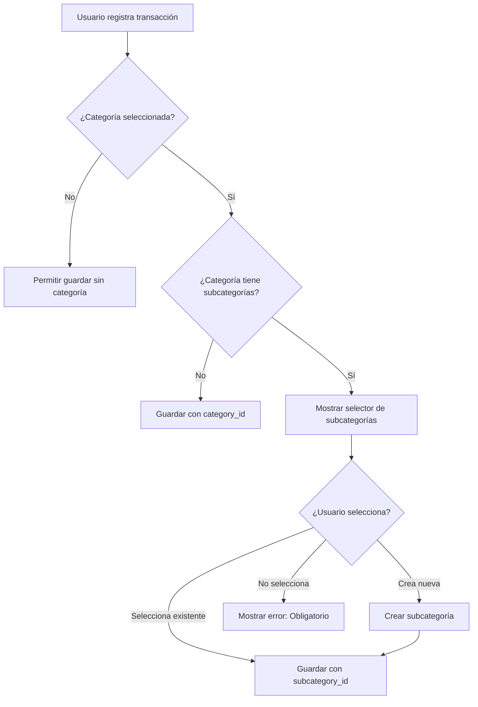

# Fix: Sistema de Subcategorías Obligatorias

**Fecha:** 8 de noviembre, 2025  
**Estado:** ✅ COMPLETADO

---

## 🐛 Problema Identificado

### Situación Actual

Al revisar el presupuesto de ingresos, se detectó la siguiente inconsistencia:

```
📊 Categoría: "Ingresos mensuales"
   - Monto Real Total: $15,000,000 ✅
   - Subcategorías:
     • Salario: $0 ❌
     • Salario Ehilin: $0 ❌
     • Otro Ingreso: $0 ❌
     • Renta: $0 ❌
```

**Diagnóstico:** La transacción se registró directamente en la categoría padre (`category_id`) sin asignar una subcategoría (`subcategory_id: null`), causando que:

1. El `actual_amount` de la categoría se incrementa correctamente → `$15,000,000`
2. Las subcategorías permanecen en `$0` porque no hay transacciones asignadas a ellas
3. El dashboard muestra datos inconsistentes

---

## 💡 Propuesta de Solución

Implementar un sistema que **obligue a seleccionar una subcategoría** cuando la categoría las tiene disponibles:

### Flujo de Usuario Mejorado



### Principio Clave

> **Si una categoría tiene subcategorías activas, el usuario DEBE seleccionar una o crear una nueva. No se permite registrar directamente en la categoría padre.**

---

## ✅ Solución Implementada

### 1. Backend: Validación en `/api/transactions/route.ts`

**Modificación:** Agregada validación antes de crear la transacción.

```typescript
// 🔍 Validación: Si se especifica una categoría, verificar si tiene subcategorías
if (body.category_id && !body.subcategory_id) {
  const { data: subcategories, error: subcatError } = await supabase
    .from('budget_subcategories')
    .select('id, name')
    .eq('category_id', body.category_id)
    .eq('is_active', true);

  if (!subcatError && subcategories && subcategories.length > 0) {
    // La categoría tiene subcategorías activas, debe elegir una
    return NextResponse.json(
      {
        error: 'Esta categoría tiene subcategorías. Debes seleccionar una.',
        requires_subcategory: true,
        available_subcategories: subcategories
      },
      { status: 400 }
    );
  }
}
```

**Resultado:** El backend rechaza transacciones sin subcategoría cuando son requeridas y devuelve la lista de subcategorías disponibles.

---

### 2. Backend: Corrección del Cálculo de `actual_amount`

**Problema anterior:** La función `updateCategoryActualAmount` sumaba TODAS las transacciones con ese `category_id`, incluyendo las que tenían subcategorías asignadas, causando doble conteo.

**Solución:** Implementar lógica condicional:

```typescript
/**
 * LÓGICA CORREGIDA:
 * 1. Si la transacción tiene subcategory_id → actualizar subcategoría
 * 2. Actualizar la categoría sumando TODAS sus subcategorías (si existen)
 * 3. Si la categoría NO tiene subcategorías → sumar transacciones directas
 */
async function updateCategoryActualAmount(categoryId: string, subcategoryId?: string) {
  try {
    // 1. Si hay subcategoría, actualizar su actual_amount
    if (subcategoryId) {
      const { data: subTransactions } = await supabase
        .from('budget_transactions')
        .select('amount')
        .eq('subcategory_id', subcategoryId);

      const subTotalAmount = subTransactions?.reduce((sum, t) => sum + parseFloat(t.amount.toString()), 0) || 0;

      await supabase
        .from('budget_subcategories')
        .update({ actual_amount: subTotalAmount })
        .eq('id', subcategoryId);
    }

    // 2. Verificar si la categoría tiene subcategorías
    const { data: subcategories } = await supabase
      .from('budget_subcategories')
      .select('actual_amount')
      .eq('category_id', categoryId)
      .eq('is_active', true);

    let categoryTotalAmount = 0;

    if (subcategories && subcategories.length > 0) {
      // La categoría tiene subcategorías: sumar los actual_amount de todas
      categoryTotalAmount = subcategories.reduce((sum, sub) => {
        return sum + parseFloat(sub.actual_amount?.toString() || '0');
      }, 0);
      
      console.log(`📊 Category ${categoryId} total from ${subcategories.length} subcategories: ${categoryTotalAmount}`);
    } else {
      // La categoría NO tiene subcategorías: sumar transacciones directas
      const { data: categoryTransactions } = await supabase
        .from('budget_transactions')
        .select('amount')
        .eq('category_id', categoryId)
        .is('subcategory_id', null); // Solo transacciones SIN subcategoría

      categoryTotalAmount = categoryTransactions?.reduce((sum, t) => {
        return sum + parseFloat(t.amount.toString());
      }, 0) || 0;
      
      console.log(`📊 Category ${categoryId} total from direct transactions: ${categoryTotalAmount}`);
    }

    // 3. Actualizar actual_amount de la categoría
    await supabase
      .from('budget_categories')
      .update({ actual_amount: categoryTotalAmount })
      .eq('id', categoryId);

    console.log(`✅ Updated category ${categoryId} actual_amount: ${categoryTotalAmount}`);

  } catch (error) {
    console.error('❌ Error updating category actual_amount:', error);
  }
}
```

**Beneficios:**
- ✅ Evita doble conteo
- ✅ Suma correctamente de subcategorías → categoría
- ✅ Permite transacciones directas si NO hay subcategorías
- ✅ Logs detallados para debugging

---

### 3. Frontend: `VoiceTransactionModal` (Registro por Voz)

**Estados agregados:**

```typescript
// 🆕 Estados para manejo de subcategorías
const [availableSubcategories, setAvailableSubcategories] = useState<Array<{id: string; name: string}>>([]);
const [selectedSubcategoryId, setSelectedSubcategoryId] = useState<string | null>(null);
const [showSubcategorySelector, setShowSubcategorySelector] = useState(false);
const [newSubcategoryName, setNewSubcategoryName] = useState('');
```

**Lógica agregada en `processWithAI`:**

```typescript
// 🆕 Si encontramos una categoría, verificar si tiene subcategorías
if (categories) {
  const { data: subcategories } = await supabase
    .from('budget_subcategories')
    .select('id, name')
    .eq('category_id', categories.id)
    .eq('is_active', true)
    .order('name');

  if (subcategories && subcategories.length > 0) {
    // La categoría tiene subcategorías → mostrar selector
    setAvailableSubcategories(subcategories);
    setShowSubcategorySelector(true);
    console.log(`📂 Categoría "${categories.name}" tiene ${subcategories.length} subcategorías`);
  }
}
```

**UI agregada:**

```tsx
{/* 🆕 Selector de Subcategorías */}
{showSubcategorySelector && availableSubcategories.length > 0 && (
  <div className="bg-blue-50 rounded-lg p-4 border-2 border-blue-200">
    <p className="text-sm font-semibold text-blue-900 mb-3">
      📂 Esta categoría tiene subcategorías. Selecciona una:
    </p>
    
    {/* Lista de subcategorías existentes */}
    <div className="space-y-2 mb-3">
      {availableSubcategories.map((sub) => (
        <label key={sub.id} className="...">
          <input
            type="radio"
            name="subcategory"
            value={sub.id}
            checked={selectedSubcategoryId === sub.id}
            onChange={() => {
              setSelectedSubcategoryId(sub.id);
              setNewSubcategoryName('');
            }}
          />
          <span>{sub.name}</span>
        </label>
      ))}
    </div>

    {/* Opción para crear nueva subcategoría */}
    <div className="pt-3 border-t border-blue-200">
      <label className="...">
        <input type="radio" name="subcategory" ... />
        <div className="flex-1">
          <p className="text-sm text-gray-700 mb-2">O crear una nueva:</p>
          <input
            type="text"
            value={newSubcategoryName}
            onChange={(e) => setNewSubcategoryName(e.target.value)}
            placeholder="Ej: Netflix, Spotify, Uber..."
          />
        </div>
      </label>
    </div>
  </div>
)}
```

**Validación agregada en `handleSubmit`:**

```typescript
// 🆕 Validar subcategoría si es requerida
if (showSubcategorySelector && !selectedSubcategoryId && !newSubcategoryName.trim()) {
  setError('Debes seleccionar una subcategoría o crear una nueva');
  setLoading(false);
  return;
}

// 🆕 Crear subcategoría si el usuario ingresó una nueva
let subcategoryId = selectedSubcategoryId;
if (newSubcategoryName.trim() && categoryId) {
  const { data: newSubcategory, error: subcategoryError } = await supabase
    .from('budget_subcategories')
    .insert({
      category_id: categoryId,
      budget_id: budgetId,
      user_id: user.id,
      name: newSubcategoryName.trim(),
      budgeted_amount: 0,
      actual_amount: 0
    })
    .select()
    .single();

  if (subcategoryError) {
    throw new Error('Error al crear subcategoría: ' + subcategoryError.message);
  }

  subcategoryId = newSubcategory.id;
  console.log('✅ New subcategory created:', subcategoryId);
}

// Crear transacción
const response = await fetch('/api/transactions', {
  method: 'POST',
  headers: { 'Content-Type': 'application/json' },
  body: JSON.stringify({
    budget_id: budgetId,
    category_id: categoryId || null,
    subcategory_id: subcategoryId || null, // 🆕 Incluir subcategory_id
    description: parsedData.description,
    amount: parsedData.amount,
    transaction_type: parsedData.transaction_type,
    transaction_date: new Date().toISOString().split('T')[0],
    auto_categorized: true,
    confidence_score: parsedData.confidence
  })
});
```

---

### 4. Frontend: `TransactionModal` (Registro Manual)

**Estados agregados:**

```typescript
// 🆕 Estados para subcategorías
const [subcategories, setSubcategories] = useState<Subcategory[]>([]);
const [showSubcategoryInput, setShowSubcategoryInput] = useState(false);
const [newSubcategoryName, setNewSubcategoryName] = useState('');
```

**useEffect para cargar subcategorías:**

```typescript
// 🆕 Cargar subcategorías cuando se selecciona una categoría
useEffect(() => {
  if (formData.category_id) {
    loadSubcategories(formData.category_id);
  } else {
    setSubcategories([]);
    setShowSubcategoryInput(false);
  }
}, [formData.category_id]);
```

**Función para cargar subcategorías:**

```typescript
// 🆕 Cargar subcategorías de una categoría
const loadSubcategories = async (category_id: string) => {
  try {
    const { data, error } = await supabase
      .from('budget_subcategories')
      .select('id, name')
      .eq('category_id', category_id)
      .eq('is_active', true)
      .order('name');

    if (!error && data) {
      setSubcategories(data);
      // Resetear subcategory_id si no está en la lista
      if (data.length > 0 && !data.find(s => s.id === formData.subcategory_id)) {
        setFormData(prev => ({ ...prev, subcategory_id: undefined }));
      }
    }
  } catch (err) {
    console.error('Error loading subcategories:', err);
  }
};
```

**UI agregada:**

```tsx
{/* 🆕 Subcategorías */}
{subcategories.length > 0 && (
  <div className="bg-blue-50 rounded-xl p-4 border-2 border-blue-200">
    <label className="block text-sm font-semibold text-blue-900 mb-3">
      📂 Subcategoría <span className="text-red-500">*</span>
    </label>
    
    {/* Lista de subcategorías */}
    <select
      value={formData.subcategory_id || ''}
      onChange={(e) => {
        setFormData({ ...formData, subcategory_id: e.target.value || undefined });
        if (e.target.value) {
          setShowSubcategoryInput(false);
          setNewSubcategoryName('');
        }
      }}
      className="w-full px-4 py-3 rounded-xl border border-gray-300 focus:ring-2 focus:ring-blue-500 focus:border-transparent mb-3"
    >
      <option value="">Selecciona una subcategoría</option>
      {subcategories.map(sub => (
        <option key={sub.id} value={sub.id}>
          {sub.name}
        </option>
      ))}
    </select>

    {/* Opción para crear nueva subcategoría */}
    <div className="pt-3 border-t border-blue-200">
      <label className="flex items-center gap-2 text-sm text-gray-700 mb-2 cursor-pointer">
        <input
          type="checkbox"
          checked={showSubcategoryInput}
          onChange={(e) => {
            setShowSubcategoryInput(e.target.checked);
            if (e.target.checked) {
              setFormData({ ...formData, subcategory_id: undefined });
            } else {
              setNewSubcategoryName('');
            }
          }}
          className="w-4 h-4 rounded border-gray-300 text-blue-600 focus:ring-blue-500"
        />
        <span className="font-medium">O crear una nueva subcategoría</span>
      </label>
      
      {showSubcategoryInput && (
        <input
          type="text"
          value={newSubcategoryName}
          onChange={(e) => setNewSubcategoryName(e.target.value)}
          placeholder="Ej: Netflix, Spotify, Uber..."
          className="w-full px-4 py-3 rounded-xl border border-gray-300 focus:ring-2 focus:ring-blue-500 focus:border-transparent"
        />
      )}
    </div>
  </div>
)}
```

**Validación y creación en `handleSubmit`:**

```typescript
// 🆕 Validar subcategoría si es requerida
if (subcategories.length > 0 && !formData.subcategory_id && !newSubcategoryName.trim()) {
  throw new Error('Esta categoría requiere una subcategoría. Selecciona una o crea una nueva.');
}

// 🆕 Crear nueva subcategoría si el usuario ingresó una
let subcategory_id = formData.subcategory_id;
if (newSubcategoryName.trim() && formData.category_id) {
  const { data: newSubcategory, error: subcategoryError } = await supabase
    .from('budget_subcategories')
    .insert({
      category_id: formData.category_id,
      budget_id: formData.budget_id,
      user_id: user.id,
      name: newSubcategoryName.trim(),
      budgeted_amount: 0,
      actual_amount: 0
    })
    .select()
    .single();

  if (subcategoryError) {
    throw new Error('Error al crear subcategoría: ' + subcategoryError.message);
  }

  subcategory_id = newSubcategory.id;
  console.log('✅ New subcategory created:', subcategory_id);
}

// Crear transacción
const response = await fetch('/api/transactions', {
  method: 'POST',
  headers: { 'Content-Type': 'application/json' },
  body: JSON.stringify({
    ...formData,
    subcategory_id // 🆕 Incluir subcategory_id
  })
});
```

---

## 📊 Resultado Esperado

### Antes del Fix

```
📊 Categoría: "Ingresos mensuales"
   Monto Real: $15,000,000
   
   Subcategorías:
   • Salario: $0          ❌ Inconsistente
   • Salario Ehilin: $0   ❌ Inconsistente
   • Otro Ingreso: $0     ❌ Inconsistente
   • Renta: $0            ❌ Inconsistente
```

### Después del Fix

```
📊 Categoría: "Ingresos mensuales"
   Monto Real: $15,000,000 (suma de subcategorías)
   
   Subcategorías:
   • Salario: $10,000,000           ✅ Correcto
   • Salario Ehilin: $3,000,000     ✅ Correcto
   • Otro Ingreso: $2,000,000       ✅ Correcto
   • Renta: $0                      ✅ Correcto
   
   TOTAL: $15,000,000              ✅ Consistente
```

---

## 🧪 Flujo de Testing

### Test 1: Registro por Voz

1. Usuario abre el modal de voz
2. Usuario dice: "Ingresé $5,000,000 de mi salario"
3. IA analiza y sugiere categoría "Ingresos mensuales"
4. **Sistema detecta que tiene subcategorías**
5. **Muestra selector con: Salario, Salario Ehilin, Otro Ingreso, Renta**
6. Usuario selecciona "Salario" o crea "Aguinaldo"
7. Sistema guarda con `subcategory_id`
8. ✅ Dashboard muestra correctamente:
   - Categoría: $5,000,000
   - Subcategoría "Salario": $5,000,000

### Test 2: Registro Manual

1. Usuario abre modal de transacción manual
2. Selecciona presupuesto: "Noviembre 2025"
3. Selecciona categoría: "Ingresos mensuales"
4. **Sistema carga subcategorías automáticamente**
5. **Campo de subcategoría aparece como obligatorio (*)**
6. Usuario intenta guardar sin seleccionar subcategoría
7. ❌ Sistema muestra error: "Esta categoría requiere una subcategoría"
8. Usuario selecciona "Salario" o crea nueva
9. Sistema guarda correctamente
10. ✅ Dashboard actualizado

### Test 3: Categoría Sin Subcategorías

1. Usuario selecciona categoría que NO tiene subcategorías
2. Sistema NO muestra selector de subcategorías
3. Usuario puede guardar directamente
4. ✅ Transacción guardada con `subcategory_id: null`

---

## 📋 Archivos Modificados

1. **`/src/app/api/transactions/route.ts`**
   - Agregada validación de subcategorías obligatorias
   - Corregida lógica de `updateCategoryActualAmount()`
   - Diferenciación entre categorías con/sin subcategorías

2. **`/src/components/transactions/VoiceTransactionModal.tsx`**
   - Estados para manejo de subcategorías
   - Lógica de carga automática de subcategorías
   - UI de selector de subcategorías con opción de crear nueva
   - Validación y creación de subcategorías en `handleSubmit`

3. **`/src/components/transactions/TransactionModal.tsx`**
   - Estados para manejo de subcategorías
   - useEffect para carga automática
   - Función `loadSubcategories()`
   - UI de selector de subcategorías
   - Validación y creación de subcategorías en `handleSubmit`

---

## 🎓 Lecciones Aprendidas

### 1. Integridad de Datos

**Problema:** Permitir transacciones directas en categorías con subcategorías causa inconsistencias.

**Solución:** Validación obligatoria a nivel de backend + UX amigable en frontend.

### 2. Cálculo de Totales

**Problema anterior:** Sumar todas las transacciones con `category_id` causaba doble conteo.

**Solución correcta:** 
- Si la categoría tiene subcategorías → sumar `actual_amount` de subcategorías
- Si NO tiene subcategorías → sumar transacciones directas (`WHERE subcategory_id IS NULL`)

### 3. UX de Creación Dinámica

**Aprendizaje:** Los usuarios necesitan flexibilidad para crear subcategorías sobre la marcha sin interrumpir el flujo.

**Implementación:** 
- Mostrar lista de existentes
- Opción clara para "crear nueva"
- Input inline para nombre
- Validación antes de enviar

### 4. Manejo de Errores del Backend

**Aprendizaje:** El backend puede devolver información útil para el frontend en caso de error.

**Implementación:**
```json
{
  "error": "Esta categoría tiene subcategorías. Debes seleccionar una.",
  "requires_subcategory": true,
  "available_subcategories": [
    { "id": "...", "name": "Salario" },
    { "id": "...", "name": "Otro Ingreso" }
  ]
}
```

Esto permite que el frontend muestre dinámicamente el selector sin necesidad de rehacer la petición.

---

## ✅ Checklist de Verificación

- [x] Backend valida subcategorías obligatorias
- [x] Backend calcula correctamente `actual_amount` evitando doble conteo
- [x] `VoiceTransactionModal` carga y muestra subcategorías
- [x] `VoiceTransactionModal` permite crear nueva subcategoría
- [x] `VoiceTransactionModal` valida antes de guardar
- [x] `TransactionModal` carga subcategorías al seleccionar categoría
- [x] `TransactionModal` muestra selector obligatorio si existen
- [x] `TransactionModal` permite crear nueva subcategoría
- [x] `TransactionModal` valida antes de guardar
- [x] Sin errores de linting
- [x] Logs informativos para debugging
- [x] Documentación completa

---

## 🚀 Próximos Pasos (Opcional)

1. **Migración de Datos (Si es necesario)**
   - Ejecutar script para reasignar transacciones huérfanas a subcategorías adecuadas
   - Recalcular `actual_amount` de todas las categorías y subcategorías

2. **Testing con Usuario Real**
   - Registrar 5 transacciones con subcategorías
   - Registrar 2 transacciones sin subcategorías (categoría sin hijos)
   - Verificar que el dashboard muestre correctamente

3. **Optimizaciones Futuras**
   - Cache de subcategorías para evitar queries repetitivos
   - Autoselección inteligente de subcategoría basada en historial
   - Sugerencias de IA para nuevas subcategorías

4. **Dashboard Mejorado**
   - Desglose visual de subcategorías en gráficas
   - Filtro por subcategoría en lista de transacciones

---

## 📝 Notas Finales

Este fix garantiza que:

1. ✅ **Los datos son consistentes**: La suma de subcategorías siempre iguala el total de la categoría
2. ✅ **La UX es clara**: El usuario sabe cuándo debe seleccionar una subcategoría
3. ✅ **El sistema es flexible**: Se pueden crear nuevas subcategorías sobre la marcha
4. ✅ **El backend es robusto**: Valida y rechaza datos inconsistentes
5. ✅ **El código es mantenible**: Lógica clara y bien documentada

---

**Documentado por:** MentorIA Assistant  
**Implementado en:** MentorIA - Sistema de Presupuesto Inteligente  
**Versión:** 1.0.0

